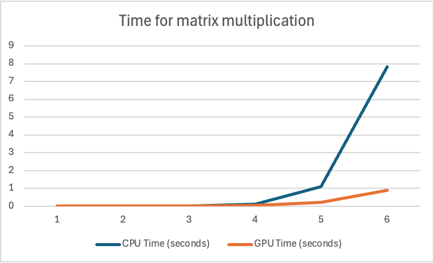

# MiniTorch Module 3


* Docs: https://minitorch.github.io/

* Overview: https://minitorch.github.io/module3.html


You will need to modify `tensor_functions.py` slightly in this assignment.

* Tests:

```
python run_tests.py
```

* Note:

Several of the tests for this assignment will only run if you are on a GPU machine and will not
run on github's test infrastructure. Please follow the instructions to setup up a colab machine
to run these tests.

This assignment requires the following files from the previous assignments. You can get these by running

```bash
python sync_previous_module.py previous-module-dir current-module-dir
```

The files that will be synced are:

        minitorch/tensor_data.py minitorch/tensor_functions.py minitorch/tensor_ops.py minitorch/operators.py minitorch/scalar.py minitorch/scalar_functions.py minitorch/module.py minitorch/autodiff.py minitorch/module.py project/run_manual.py project/run_scalar.py project/run_tensor.py minitorch/operators.py minitorch/module.py minitorch/autodiff.py minitorch/tensor.py minitorch/datasets.py minitorch/testing.py minitorch/optim.py

## Task 3.1
Diagnostics output:

        MAP

        ================================================================================
        Parallel Accelerator Optimizing:  Function tensor_map.<locals>._map,
        /Users/yaxuan/Documents/GitHub/mod3-Rebabit/minitorch/fast_ops.py (163)
        ================================================================================


        Parallel loop listing for  Function tensor_map.<locals>._map, /Users/yaxuan/Documents/GitHub/mod3-Rebabit/minitorch/fast_ops.py (163)
        -----------------------------------------------------------------------------------------------------------------|loop #ID
        def _map(                                                                                                    |
                out: Storage,                                                                                            |
                out_shape: Shape,                                                                                        |
                out_strides: Strides,                                                                                    |
                in_storage: Storage,                                                                                     |
                in_shape: Shape,                                                                                         |
                in_strides: Strides,                                                                                     |
        ) -> None:                                                                                                   |
                # TODO: Implement for Task 3.1.                                                                          |
                """Optimized tensor_map function using Numba.                                                            |
                                                                                                                        |
                Optimizations:                                                                                           |
                1. **Stride Alignment Check**: If `out` and `in_storage` are stride-aligned (same shape and strides),    |
                they are treated as 1D arrays for direct element-wise mapping, reducing indexing overhead.               |
                                                                                                                        |
                2. **Parallel Execution**: Uses Numba’s `prange` for parallel processing, improving performance          |
                for large tensors in both aligned and non-aligned cases.                                                 |
                                                                                                                        |
                3. **Efficient Indexing for Non-Aligned Tensors**: For non-aligned tensors, multi-dimensional            |
                indexing with `to_index`, `broadcast_index`, and `index_to_position` maintains compatibility             |
                across shapes, while benefiting from Numba's optimizations.                                              |
                """                                                                                                      |
                aligned = np.array_equal(out_strides, in_strides) and np.array_equal(out_shape, in_shape)                |
                if aligned:                                                                                              |
                for i in prange(len(out)):---------------------------------------------------------------------------| #0
                        out[i] = fn(in_storage[i])                                                                       |
                else:                                                                                                    |
                for ordinal in prange(len(out)):---------------------------------------------------------------------| #1
                        # initialize index buffers within the loop                                                       |
                        in_index = np.empty(MAX_DIMS, dtype=np.int32)  # use np.empty instead of np.zeros                |
                        out_index = np.empty(MAX_DIMS, dtype=np.int32)                                                   |
                        to_index(ordinal, out_shape, out_index)                                                          |
                        broadcast_index(out_index, out_shape, in_shape, in_index)                                        |
                        in_position = index_to_position(in_index, in_strides)                                            |
                        out_position = index_to_position(out_index, out_strides)                                         |
                        out[out_position] = fn(in_storage[in_position])                                                  |
        --------------------------------- Fusing loops ---------------------------------
        Attempting fusion of parallel loops (combines loops with similar properties)...
        Following the attempted fusion of parallel for-loops there are 2 parallel for-
        loop(s) (originating from loops labelled: #0, #1).
        --------------------------------------------------------------------------------
        ----------------------------- Before Optimisation ------------------------------
        --------------------------------------------------------------------------------
        ------------------------------ After Optimisation ------------------------------
        Parallel structure is already optimal.
        --------------------------------------------------------------------------------
        --------------------------------------------------------------------------------

        ---------------------------Loop invariant code motion---------------------------
        Allocation hoisting:
        The memory allocation derived from the instruction at
        /Users/yaxuan/Documents/GitHub/mod3-Rebabit/minitorch/fast_ops.py (192) is
        hoisted out of the parallel loop labelled #1 (it will be performed before the
        loop is executed and reused inside the loop):
        Allocation:: in_index = np.empty(MAX_DIMS, dtype=np.int32)  # use np.empty
        instead of np.zeros
        - numpy.empty() is used for the allocation.
        The memory allocation derived from the instruction at
        /Users/yaxuan/Documents/GitHub/mod3-Rebabit/minitorch/fast_ops.py (193) is
        hoisted out of the parallel loop labelled #1 (it will be performed before the
        loop is executed and reused inside the loop):
        Allocation:: out_index = np.empty(MAX_DIMS, dtype=np.int32)
        - numpy.empty() is used for the allocation.
        None
        ZIP

        ================================================================================
        Parallel Accelerator Optimizing:  Function tensor_zip.<locals>._zip,
        /Users/yaxuan/Documents/GitHub/mod3-Rebabit/minitorch/fast_ops.py (225)
        ================================================================================


        Parallel loop listing for  Function tensor_zip.<locals>._zip, /Users/yaxuan/Documents/GitHub/mod3-Rebabit/minitorch/fast_ops.py (225)
        ---------------------------------------------------------------------------------------------------------------------------------------------------------------------------------|loop #ID
        def _zip(                                                                                                                                                                    |
                out: Storage,                                                                                                                                                            |
                out_shape: Shape,                                                                                                                                                        |
                out_strides: Strides,                                                                                                                                                    |
                a_storage: Storage,                                                                                                                                                      |
                a_shape: Shape,                                                                                                                                                          |
                a_strides: Strides,                                                                                                                                                      |
                b_storage: Storage,                                                                                                                                                      |
                b_shape: Shape,                                                                                                                                                          |
                b_strides: Strides,                                                                                                                                                      |
        ) -> None:                                                                                                                                                                   |
                # TODO: Implement for Task 3.1.                                                                                                                                          |
                aligned = np.array_equal(out_strides, a_strides) and np.array_equal(a_strides, b_strides) and np.array_equal(out_shape, a_shape) and np.array_equal(a_shape, b_shape)    |
                if aligned:                                                                                                                                                              |
                for i in prange(len(out)):-------------------------------------------------------------------------------------------------------------------------------------------| #2
                        out[i] = fn(a_storage[i], b_storage[i])                                                                                                                          |
                else:                                                                                                                                                                    |
                for ordinal in prange(len(out)):-------------------------------------------------------------------------------------------------------------------------------------| #3
                        a_index = np.empty(MAX_DIMS, dtype=np.int32)                                                                                                                     |
                        b_index = np.empty(MAX_DIMS, dtype=np.int32)                                                                                                                     |
                        out_index = np.empty(MAX_DIMS, dtype=np.int32)                                                                                                                   |
                        to_index(ordinal, out_shape, out_index)                                                                                                                          |
                        broadcast_index(out_index, out_shape, a_shape, a_index)                                                                                                          |
                        broadcast_index(out_index, out_shape, b_shape, b_index)                                                                                                          |
                        a_position = index_to_position(a_index, a_strides)                                                                                                               |
                        b_position = index_to_position(b_index, b_strides)                                                                                                               |
                        out_position = index_to_position(out_index, out_strides)                                                                                                         |
                        out[out_position] = fn(a_storage[a_position], b_storage[b_position])                                                                                             |
        --------------------------------- Fusing loops ---------------------------------
        Attempting fusion of parallel loops (combines loops with similar properties)...
        Following the attempted fusion of parallel for-loops there are 2 parallel for-
        loop(s) (originating from loops labelled: #2, #3).
        --------------------------------------------------------------------------------
        ----------------------------- Before Optimisation ------------------------------
        --------------------------------------------------------------------------------
        ------------------------------ After Optimisation ------------------------------
        Parallel structure is already optimal.
        --------------------------------------------------------------------------------
        --------------------------------------------------------------------------------

        ---------------------------Loop invariant code motion---------------------------
        Allocation hoisting:
        The memory allocation derived from the instruction at
        /Users/yaxuan/Documents/GitHub/mod3-Rebabit/minitorch/fast_ops.py (243) is
        hoisted out of the parallel loop labelled #3 (it will be performed before the
        loop is executed and reused inside the loop):
        Allocation:: a_index = np.empty(MAX_DIMS, dtype=np.int32)
        - numpy.empty() is used for the allocation.
        The memory allocation derived from the instruction at
        /Users/yaxuan/Documents/GitHub/mod3-Rebabit/minitorch/fast_ops.py (244) is
        hoisted out of the parallel loop labelled #3 (it will be performed before the
        loop is executed and reused inside the loop):
        Allocation:: b_index = np.empty(MAX_DIMS, dtype=np.int32)
        - numpy.empty() is used for the allocation.
        The memory allocation derived from the instruction at
        /Users/yaxuan/Documents/GitHub/mod3-Rebabit/minitorch/fast_ops.py (245) is
        hoisted out of the parallel loop labelled #3 (it will be performed before the
        loop is executed and reused inside the loop):
        Allocation:: out_index = np.empty(MAX_DIMS, dtype=np.int32)
        - numpy.empty() is used for the allocation.
        None
        REDUCE

        ================================================================================
        Parallel Accelerator Optimizing:  Function tensor_reduce.<locals>._reduce,
        /Users/yaxuan/Documents/GitHub/mod3-Rebabit/minitorch/fast_ops.py (278)
        ================================================================================


        Parallel loop listing for  Function tensor_reduce.<locals>._reduce, /Users/yaxuan/Documents/GitHub/mod3-Rebabit/minitorch/fast_ops.py (278)
        -----------------------------------------------------------------------------------------------------|loop #ID
        def _reduce(                                                                                     |
                out: Storage,                                                                                |
                out_shape: Shape,                                                                            |
                out_strides: Strides,                                                                        |
                a_storage: Storage,                                                                          |
                a_shape: Shape,                                                                              |
                a_strides: Strides,                                                                          |
                reduce_dim: int,                                                                             |
        ) -> None:                                                                                       |
                # TODO: Implement for Task 3.1.                                                              |
                """Optimized tensor_reduce function using Numba.                                             |
                                                                                                        |
                Optimizations:                                                                               |
                1. **Parallel Main Loop**: The outer loop uses `prange` for parallel execution.              |
                2. **Numpy Buffers for Indices**: Efficiently handles indexing with pre-computed strides.    |
                3. **Position Increment in Inner Loop**: Avoids repeated `index_to_position` calls by        |
                incrementing `a_position` directly along the reduction dimension.                            |
                """                                                                                          |
                reduce_stride = a_strides[reduce_dim]                                                        |
                reduce_size = a_shape[reduce_dim]                                                            |
                for ordinal in prange(len(out)):-------------------------------------------------------------| #4
                a_index = np.empty(MAX_DIMS, dtype=np.int32)                                             |
                out_index = np.empty(MAX_DIMS, dtype=np.int32)                                           |
                to_index(ordinal, out_shape, out_index)                                                  |
                for i in range(len(out_shape)):                                                          |
                        a_index[i] = out_index[i]                                                            |
                a_index[reduce_dim] = 0                                                                  |
                a_position = index_to_position(a_index, a_strides)                                       |
                result = a_storage[a_position]                                                           |
                for i in range(1, reduce_size):                                                          |
                        a_position += reduce_stride                                                          |
                        result = fn(result, a_storage[int(a_position)])                                      |
                out[ordinal] = result                                                                    |
        --------------------------------- Fusing loops ---------------------------------
        Attempting fusion of parallel loops (combines loops with similar properties)...
        Following the attempted fusion of parallel for-loops there are 1 parallel for-
        loop(s) (originating from loops labelled: #4).
        --------------------------------------------------------------------------------
        ----------------------------- Before Optimisation ------------------------------
        --------------------------------------------------------------------------------
        ------------------------------ After Optimisation ------------------------------
        Parallel structure is already optimal.
        --------------------------------------------------------------------------------
        --------------------------------------------------------------------------------

        ---------------------------Loop invariant code motion---------------------------
        Allocation hoisting:
        The memory allocation derived from the instruction at
        /Users/yaxuan/Documents/GitHub/mod3-Rebabit/minitorch/fast_ops.py (299) is
        hoisted out of the parallel loop labelled #4 (it will be performed before the
        loop is executed and reused inside the loop):
        Allocation:: a_index = np.empty(MAX_DIMS, dtype=np.int32)
        - numpy.empty() is used for the allocation.
        The memory allocation derived from the instruction at
        /Users/yaxuan/Documents/GitHub/mod3-Rebabit/minitorch/fast_ops.py (300) is
        hoisted out of the parallel loop labelled #4 (it will be performed before the
        loop is executed and reused inside the loop):
        Allocation:: out_index = np.empty(MAX_DIMS, dtype=np.int32)
        - numpy.empty() is used for the allocation.
        None
## Task 3.2
Diagnostics output:

        MATRIX MULTIPLY

        ================================================================================
        Parallel Accelerator Optimizing:  Function _tensor_matrix_multiply,
        /Users/yaxuan/Documents/GitHub/mod3-Rebabit/minitorch/fast_ops.py (315)
        ================================================================================


        Parallel loop listing for  Function _tensor_matrix_multiply, /Users/yaxuan/Documents/GitHub/mod3-Rebabit/minitorch/fast_ops.py (315)
        -----------------------------------------------------------------------|loop #ID
        def _tensor_matrix_multiply(                                           |
        out: Storage,                                                      |
        out_shape: Shape,                                                  |
        out_strides: Strides,                                              |
        a_storage: Storage,                                                |
        a_shape: Shape,                                                    |
        a_strides: Strides,                                                |
        b_storage: Storage,                                                |
        b_shape: Shape,                                                    |
        b_strides: Strides,                                                |
        ) -> None:                                                             |
        """NUMBA tensor matrix multiply function.                          |
                                                                        |
        Should work for any tensor shapes that broadcast as long as        |
                                                                        |
        ```                                                                |
        assert a_shape[-1] == b_shape[-2]                                  |
        ```                                                                |
                                                                        |
        Optimizations:                                                     |
                                                                        |
        * Outer loop in parallel                                           |
        * No index buffers or function calls                               |
        * Inner loop should have no global writes, 1 multiply.             |
                                                                        |
                                                                        |
        Args:                                                              |
        ----                                                               |
                out (Storage): storage for `out` tensor                        |
                out_shape (Shape): shape for `out` tensor                      |
                out_strides (Strides): strides for `out` tensor                |
                a_storage (Storage): storage for `a` tensor                    |
                a_shape (Shape): shape for `a` tensor                          |
                a_strides (Strides): strides for `a` tensor                    |
                b_storage (Storage): storage for `b` tensor                    |
                b_shape (Shape): shape for `b` tensor                          |
                b_strides (Strides): strides for `b` tensor                    |
                                                                        |
        Returns:                                                           |
        -------                                                            |
                None : Fills in `out`                                          |
                                                                        |
        """                                                                |
        # TODO: Implement for Task 3.2.                                    |
        a_batch_stride = a_strides[0] if a_shape[0] > 1 else 0             |
        b_batch_stride = b_strides[0] if b_shape[0] > 1 else 0             |
        out_batch_stride = out_strides[0] if out_shape[0] > 1 else 0       |
                                                                        |
        # Extract dimensions                                               |
        batch_size = out_shape[0]                                          |
        out_rows = out_shape[1]                                            |
        out_cols = out_shape[2]                                            |
        inner_dim = a_shape[-1]                                            |
                                                                        |
        # Parallelize outer loop over batches and rows                     |
        for batch in prange(batch_size):-----------------------------------| #6
                a_batch_offset = batch * a_batch_stride                        |
                b_batch_offset = batch * b_batch_stride                        |
                out_batch_offset = batch * out_batch_stride                    |
                                                                        |
                for i in range(out_rows):                                      |
                a_row_offset = a_batch_offset + i * a_strides[1]           |
                out_row_offset = out_batch_offset + i * out_strides[1]     |
                for j in range(out_cols):                                  |
                        result = 0.0                                           |
                        b_column_offset = b_batch_offset + j * b_strides[2]    |
                        for k in range(inner_dim):                             |
                        a_idx = a_row_offset + k * a_strides[2]            |
                        b_idx = k * b_strides[1] + b_column_offset         |
                        result += a_storage[a_idx] * b_storage[b_idx]      |
                                                                        |
                        out_idx = out_row_offset + j * out_strides[2]          |
                        out[out_idx] = result                                  |
        --------------------------------- Fusing loops ---------------------------------
        Attempting fusion of parallel loops (combines loops with similar properties)...
        Following the attempted fusion of parallel for-loops there are 1 parallel for-
        loop(s) (originating from loops labelled: #6).
        --------------------------------------------------------------------------------
        ----------------------------- Before Optimisation ------------------------------
        --------------------------------------------------------------------------------
        ------------------------------ After Optimisation ------------------------------
        Parallel structure is already optimal.
        --------------------------------------------------------------------------------
        --------------------------------------------------------------------------------

        ---------------------------Loop invariant code motion---------------------------
        Allocation hoisting:
        No allocation hoisting found
        None
## Task 3.4
Comparison of fast & cuda implementation:
```
!cd $DIR; PYTHONPATH=/content/$DIR python3.12 project/plot_time_mm.py
```

```
32 : 0.0009478092193603516 0.004097938537597656
64 : 0.002943277359008789 0.005627632141113281
128 : 0.014604139328002929 0.012697649002075196
256 : 0.13338379859924315 0.06497626304626465
512 : 1.113376998901367 0.21291189193725585
1024 : 7.846199417114258 0.9015083312988281
```

## Task 3.5
### Split
#### CPU
```
!cd $DIR; PYTHONPATH=/content/$DIR python3.12 project/run_fast_tensor.py --BACKEND cpu --HIDDEN 100 --DATASET split --RATE 0.05
```
```
Epoch 0, Loss: 5.804840685948777, Correct: 33, Time per epoch: 18.619 seconds
Epoch 10, Loss: 5.759612706145984, Correct: 33, Time per epoch: 0.121 seconds
Epoch 20, Loss: 4.887301849431546, Correct: 39, Time per epoch: 0.107 seconds
Epoch 30, Loss: 5.431249056429794, Correct: 44, Time per epoch: 0.117 seconds
Epoch 40, Loss: 4.30844978370805, Correct: 47, Time per epoch: 0.110 seconds
Epoch 50, Loss: 2.292048283674806, Correct: 45, Time per epoch: 0.108 seconds
Epoch 60, Loss: 5.995325027945183, Correct: 38, Time per epoch: 0.101 seconds
Epoch 70, Loss: 2.291936754949765, Correct: 47, Time per epoch: 0.100 seconds
Epoch 80, Loss: 2.2449328322804267, Correct: 48, Time per epoch: 0.099 seconds
Epoch 90, Loss: 2.2317842073646816, Correct: 49, Time per epoch: 0.099 seconds
Epoch 100, Loss: 1.8962073487174094, Correct: 47, Time per epoch: 0.103 seconds
Epoch 110, Loss: 1.3405676192423193, Correct: 49, Time per epoch: 0.104 seconds
Epoch 120, Loss: 1.3277939130432266, Correct: 49, Time per epoch: 0.223 seconds
Epoch 130, Loss: 1.6415318182753462, Correct: 49, Time per epoch: 0.098 seconds
Epoch 140, Loss: 2.0223506506265005, Correct: 50, Time per epoch: 0.099 seconds
Epoch 150, Loss: 0.6552494927666919, Correct: 49, Time per epoch: 0.099 seconds
Epoch 160, Loss: 0.9165465432030119, Correct: 49, Time per epoch: 0.100 seconds
Epoch 170, Loss: 1.8566329272931783, Correct: 49, Time per epoch: 0.103 seconds
Epoch 180, Loss: 0.3779482008914594, Correct: 46, Time per epoch: 0.101 seconds
Epoch 190, Loss: 1.9796024055840953, Correct: 50, Time per epoch: 0.100 seconds
Epoch 200, Loss: 0.8850329091593621, Correct: 49, Time per epoch: 0.101 seconds
Epoch 210, Loss: 0.8319584522745787, Correct: 50, Time per epoch: 0.099 seconds
Epoch 220, Loss: 0.8398335107270677, Correct: 49, Time per epoch: 0.106 seconds
Epoch 230, Loss: 0.8716165546310525, Correct: 50, Time per epoch: 0.225 seconds
Epoch 240, Loss: 0.682810941983879, Correct: 50, Time per epoch: 0.237 seconds
Epoch 250, Loss: 0.7105491510705219, Correct: 50, Time per epoch: 0.102 seconds
Epoch 260, Loss: 0.8416371167088853, Correct: 49, Time per epoch: 0.103 seconds
Epoch 270, Loss: 1.1316558136427552, Correct: 49, Time per epoch: 0.102 seconds
Epoch 280, Loss: 0.659650178577218, Correct: 49, Time per epoch: 0.100 seconds
Epoch 290, Loss: 0.6306452096342631, Correct: 50, Time per epoch: 0.102 seconds
Epoch 300, Loss: 0.2950222513267796, Correct: 49, Time per epoch: 0.105 seconds
Epoch 310, Loss: 0.726643301220537, Correct: 50, Time per epoch: 0.104 seconds
Epoch 320, Loss: 0.20680772853498156, Correct: 49, Time per epoch: 0.101 seconds
Epoch 330, Loss: 0.39883494425724925, Correct: 50, Time per epoch: 0.098 seconds
Epoch 340, Loss: 0.4584651718551007, Correct: 47, Time per epoch: 0.131 seconds
Epoch 350, Loss: 0.630536136828343, Correct: 50, Time per epoch: 0.175 seconds
Epoch 360, Loss: 1.3615458952637796, Correct: 49, Time per epoch: 0.106 seconds
Epoch 370, Loss: 0.35879474888365004, Correct: 50, Time per epoch: 0.108 seconds
Epoch 380, Loss: 0.3674996601549845, Correct: 50, Time per epoch: 0.116 seconds
Epoch 390, Loss: 0.5959296795917685, Correct: 50, Time per epoch: 0.116 seconds
Epoch 400, Loss: 0.7031458870261426, Correct: 50, Time per epoch: 0.120 seconds
Epoch 410, Loss: 0.20131905477995146, Correct: 49, Time per epoch: 0.107 seconds
Epoch 420, Loss: 0.8376437961851702, Correct: 50, Time per epoch: 0.115 seconds
Epoch 430, Loss: 0.3270446914916418, Correct: 50, Time per epoch: 0.117 seconds
Epoch 440, Loss: 0.4354514648009828, Correct: 50, Time per epoch: 0.110 seconds
Epoch 450, Loss: 1.1233252648628151, Correct: 49, Time per epoch: 0.118 seconds
Epoch 460, Loss: 1.086176541345848, Correct: 49, Time per epoch: 0.132 seconds
Epoch 470, Loss: 0.7377762792805175, Correct: 49, Time per epoch: 0.104 seconds
Epoch 480, Loss: 0.13337389338570085, Correct: 50, Time per epoch: 0.107 seconds
Epoch 490, Loss: 1.1752886323124092, Correct: 49, Time per epoch: 0.207 seconds
```
#### GPU
```
!cd $DIR; PYTHONPATH=/content/$DIR python3.12 project/run_fast_tensor.py --BACKEND gpu --HIDDEN 100 --DATASET split --RATE 0.05
```

```
Epoch 0, Loss: 7.067772703878541, Correct: 29, Time per epoch: 6.319 seconds
Epoch 10, Loss: 7.2926700049842585, Correct: 36, Time per epoch: 1.286 seconds
Epoch 20, Loss: 7.084129401759604, Correct: 37, Time per epoch: 1.188 seconds
Epoch 30, Loss: 5.612738472199355, Correct: 39, Time per epoch: 1.206 seconds
Epoch 40, Loss: 3.490015741391367, Correct: 46, Time per epoch: 1.251 seconds
Epoch 50, Loss: 4.422211986613442, Correct: 44, Time per epoch: 1.249 seconds
Epoch 60, Loss: 4.662944251875238, Correct: 42, Time per epoch: 1.183 seconds
Epoch 70, Loss: 2.2640910062884125, Correct: 46, Time per epoch: 1.212 seconds
Epoch 80, Loss: 2.438541405279595, Correct: 49, Time per epoch: 1.195 seconds
Epoch 90, Loss: 1.4078174683022526, Correct: 49, Time per epoch: 1.195 seconds
Epoch 100, Loss: 2.1541947551519565, Correct: 47, Time per epoch: 1.189 seconds
Epoch 110, Loss: 1.3060080447621671, Correct: 50, Time per epoch: 1.225 seconds
Epoch 120, Loss: 1.063000014217251, Correct: 49, Time per epoch: 1.202 seconds
Epoch 130, Loss: 0.8039157548650032, Correct: 49, Time per epoch: 1.270 seconds
Epoch 140, Loss: 0.41892217457352426, Correct: 50, Time per epoch: 1.185 seconds
Epoch 150, Loss: 2.3043434223143127, Correct: 50, Time per epoch: 1.203 seconds
Epoch 160, Loss: 1.1124970187666758, Correct: 50, Time per epoch: 1.232 seconds
Epoch 170, Loss: 0.9298985336196348, Correct: 50, Time per epoch: 1.517 seconds
Epoch 180, Loss: 0.9929461045450704, Correct: 49, Time per epoch: 1.562 seconds
Epoch 190, Loss: 1.2616782642694135, Correct: 49, Time per epoch: 1.762 seconds
Epoch 200, Loss: 0.7844707612712554, Correct: 50, Time per epoch: 1.732 seconds
Epoch 210, Loss: 0.6384536121555635, Correct: 50, Time per epoch: 1.541 seconds
Epoch 220, Loss: 0.33261134381848356, Correct: 48, Time per epoch: 1.193 seconds
Epoch 230, Loss: 0.7631318578759074, Correct: 50, Time per epoch: 1.268 seconds
Epoch 240, Loss: 0.6198236040705906, Correct: 50, Time per epoch: 1.180 seconds
Epoch 250, Loss: 1.5108712446497898, Correct: 49, Time per epoch: 1.193 seconds
Epoch 260, Loss: 0.969339278419332, Correct: 50, Time per epoch: 1.184 seconds
Epoch 270, Loss: 1.3933164441072294, Correct: 49, Time per epoch: 1.178 seconds
Epoch 280, Loss: 1.160750282542737, Correct: 50, Time per epoch: 1.181 seconds
Epoch 290, Loss: 1.1177012823558286, Correct: 50, Time per epoch: 1.181 seconds
Epoch 300, Loss: 1.841222021312694, Correct: 49, Time per epoch: 1.200 seconds
Epoch 310, Loss: 0.9310236613278304, Correct: 50, Time per epoch: 1.193 seconds
Epoch 320, Loss: 0.5199611110294511, Correct: 49, Time per epoch: 1.192 seconds
Epoch 330, Loss: 0.6129734637820158, Correct: 49, Time per epoch: 1.198 seconds
Epoch 340, Loss: 1.0081116463281883, Correct: 50, Time per epoch: 1.199 seconds
Epoch 350, Loss: 0.6182741281846832, Correct: 49, Time per epoch: 1.197 seconds
Epoch 360, Loss: 0.6559963958028397, Correct: 50, Time per epoch: 1.175 seconds
Epoch 370, Loss: 0.04885996490561376, Correct: 49, Time per epoch: 1.191 seconds
Epoch 380, Loss: 1.917830523652118, Correct: 49, Time per epoch: 1.219 seconds
Epoch 390, Loss: 0.4543201913522107, Correct: 50, Time per epoch: 1.184 seconds
Epoch 400, Loss: 1.5621380269886684, Correct: 49, Time per epoch: 1.185 seconds
Epoch 410, Loss: 0.3011307650305586, Correct: 49, Time per epoch: 1.210 seconds
Epoch 420, Loss: 0.8592109314575497, Correct: 50, Time per epoch: 1.180 seconds
Epoch 430, Loss: 1.4490130695922874, Correct: 49, Time per epoch: 1.315 seconds
Epoch 440, Loss: 1.8092770889441656, Correct: 49, Time per epoch: 1.430 seconds
Epoch 450, Loss: 1.092658029371688, Correct: 48, Time per epoch: 1.615 seconds
Epoch 460, Loss: 0.02005439233309631, Correct: 50, Time per epoch: 1.799 seconds
Epoch 470, Loss: 0.27518018539961664, Correct: 49, Time per epoch: 1.833 seconds
Epoch 480, Loss: 1.1804852719071184, Correct: 49, Time per epoch: 1.621 seconds
Epoch 490, Loss: 0.6614519753953101, Correct: 50, Time per epoch: 1.338 seconds
```
### XOR
#### CPU
```
!cd $DIR; PYTHONPATH=/content/$DIR python3.12 project/run_fast_tensor.py --BACKEND cpu --HIDDEN 100 --DATASET xor --RATE 0.05
```
```
Epoch 0, Loss: 6.435234369452466, Correct: 34, Time per epoch: 19.187 seconds
Epoch 10, Loss: 5.002895749132958, Correct: 43, Time per epoch: 0.097 seconds
Epoch 20, Loss: 4.9095057220080704, Correct: 42, Time per epoch: 0.099 seconds
Epoch 30, Loss: 5.964553469223262, Correct: 39, Time per epoch: 0.098 seconds
Epoch 40, Loss: 3.150688256770959, Correct: 43, Time per epoch: 0.102 seconds
Epoch 50, Loss: 3.5745894095919066, Correct: 44, Time per epoch: 0.100 seconds
Epoch 60, Loss: 2.7295153593769528, Correct: 45, Time per epoch: 0.099 seconds
Epoch 70, Loss: 2.6059276173229704, Correct: 45, Time per epoch: 0.100 seconds
Epoch 80, Loss: 2.5990059239816956, Correct: 48, Time per epoch: 0.103 seconds
Epoch 90, Loss: 2.0802720544366284, Correct: 47, Time per epoch: 0.099 seconds
Epoch 100, Loss: 1.03333649256905, Correct: 47, Time per epoch: 0.214 seconds
Epoch 110, Loss: 1.4365895740950856, Correct: 47, Time per epoch: 0.103 seconds
Epoch 120, Loss: 1.6914622277187887, Correct: 49, Time per epoch: 0.100 seconds
Epoch 130, Loss: 1.6080616901867022, Correct: 49, Time per epoch: 0.104 seconds
Epoch 140, Loss: 1.260785140596719, Correct: 49, Time per epoch: 0.100 seconds
Epoch 150, Loss: 0.8626010236778953, Correct: 49, Time per epoch: 0.101 seconds
Epoch 160, Loss: 1.361668994064164, Correct: 50, Time per epoch: 0.100 seconds
Epoch 170, Loss: 1.0404456233160408, Correct: 49, Time per epoch: 0.100 seconds
Epoch 180, Loss: 0.555092909804566, Correct: 50, Time per epoch: 0.099 seconds
Epoch 190, Loss: 0.7082542880747061, Correct: 50, Time per epoch: 0.102 seconds
Epoch 200, Loss: 0.8766331711873491, Correct: 50, Time per epoch: 0.101 seconds
Epoch 210, Loss: 0.5737976863543772, Correct: 50, Time per epoch: 0.224 seconds
Epoch 220, Loss: 0.19672775878434787, Correct: 50, Time per epoch: 0.224 seconds
Epoch 230, Loss: 0.6585049244146954, Correct: 50, Time per epoch: 0.102 seconds
Epoch 240, Loss: 0.774713524407188, Correct: 50, Time per epoch: 0.101 seconds
Epoch 250, Loss: 1.0902289505064877, Correct: 50, Time per epoch: 0.100 seconds
Epoch 260, Loss: 0.643337635955574, Correct: 50, Time per epoch: 0.100 seconds
Epoch 270, Loss: 0.2310289103174973, Correct: 50, Time per epoch: 0.100 seconds
Epoch 280, Loss: 0.6154004266418363, Correct: 50, Time per epoch: 0.101 seconds
Epoch 290, Loss: 0.3650021481929382, Correct: 50, Time per epoch: 0.103 seconds
Epoch 300, Loss: 0.3937973042117342, Correct: 50, Time per epoch: 0.101 seconds
Epoch 310, Loss: 0.2589320979385168, Correct: 50, Time per epoch: 0.098 seconds
Epoch 320, Loss: 1.0259157609272975, Correct: 50, Time per epoch: 0.185 seconds
Epoch 330, Loss: 0.4976912539105183, Correct: 50, Time per epoch: 0.225 seconds
Epoch 340, Loss: 0.29941353883953137, Correct: 50, Time per epoch: 0.103 seconds
Epoch 350, Loss: 0.17322517331192105, Correct: 50, Time per epoch: 0.102 seconds
Epoch 360, Loss: 0.22253413187402282, Correct: 50, Time per epoch: 0.101 seconds
Epoch 370, Loss: 0.574487077363425, Correct: 50, Time per epoch: 0.101 seconds
Epoch 380, Loss: 0.6196670399317856, Correct: 50, Time per epoch: 0.100 seconds
Epoch 390, Loss: 0.6423549438336854, Correct: 50, Time per epoch: 0.102 seconds
Epoch 400, Loss: 0.91824348913008, Correct: 50, Time per epoch: 0.103 seconds
Epoch 410, Loss: 0.27610909934738753, Correct: 50, Time per epoch: 0.102 seconds
Epoch 420, Loss: 0.06817240947787666, Correct: 50, Time per epoch: 0.100 seconds
Epoch 430, Loss: 0.09375417048613578, Correct: 50, Time per epoch: 0.120 seconds
Epoch 440, Loss: 0.42882966266165345, Correct: 50, Time per epoch: 0.161 seconds
Epoch 450, Loss: 0.3746041803054913, Correct: 50, Time per epoch: 0.099 seconds
Epoch 460, Loss: 0.32782756823924636, Correct: 50, Time per epoch: 0.103 seconds
Epoch 470, Loss: 0.5320616524537645, Correct: 50, Time per epoch: 0.104 seconds
Epoch 480, Loss: 0.6003382178219739, Correct: 50, Time per epoch: 0.102 seconds
Epoch 490, Loss: 0.2246245388886698, Correct: 50, Time per epoch: 0.107 seconds
```
#### GPU
```
!cd $DIR; PYTHONPATH=/content/$DIR python3.12 project/run_fast_tensor.py --BACKEND gpu --HIDDEN 100 --DATASET xor --RATE 0.05
```
```
Epoch 0, Loss: 7.375727233876458, Correct: 37, Time per epoch: 3.467 seconds
Epoch 10, Loss: 6.078468495745869, Correct: 42, Time per epoch: 1.290 seconds
Epoch 20, Loss: 5.0646373228255035, Correct: 43, Time per epoch: 1.181 seconds
Epoch 30, Loss: 3.1335867135519146, Correct: 43, Time per epoch: 1.183 seconds
Epoch 40, Loss: 2.3192992878280054, Correct: 44, Time per epoch: 1.177 seconds
Epoch 50, Loss: 2.7021346941655935, Correct: 46, Time per epoch: 1.272 seconds
Epoch 60, Loss: 3.134365626397329, Correct: 46, Time per epoch: 1.193 seconds
Epoch 70, Loss: 4.474306976090135, Correct: 46, Time per epoch: 1.185 seconds
Epoch 80, Loss: 1.7999009029555308, Correct: 46, Time per epoch: 1.207 seconds
Epoch 90, Loss: 2.64376661701622, Correct: 46, Time per epoch: 1.183 seconds
Epoch 100, Loss: 1.0131499484315725, Correct: 46, Time per epoch: 1.192 seconds
Epoch 110, Loss: 3.1973933669039747, Correct: 46, Time per epoch: 1.396 seconds
Epoch 120, Loss: 1.870347276206653, Correct: 46, Time per epoch: 1.562 seconds
Epoch 130, Loss: 2.415895391021435, Correct: 47, Time per epoch: 1.849 seconds
Epoch 140, Loss: 1.0647787499360262, Correct: 47, Time per epoch: 1.430 seconds
Epoch 150, Loss: 1.0085280062022943, Correct: 47, Time per epoch: 1.269 seconds
Epoch 160, Loss: 0.49059614201030655, Correct: 48, Time per epoch: 1.169 seconds
Epoch 170, Loss: 1.193722988113516, Correct: 47, Time per epoch: 1.263 seconds
Epoch 180, Loss: 1.6479213211416721, Correct: 47, Time per epoch: 1.185 seconds
Epoch 190, Loss: 2.447796771151575, Correct: 48, Time per epoch: 1.178 seconds
Epoch 200, Loss: 0.5206323554580065, Correct: 47, Time per epoch: 1.214 seconds
Epoch 210, Loss: 1.3434292908874752, Correct: 48, Time per epoch: 1.195 seconds
Epoch 220, Loss: 1.1153735228366566, Correct: 49, Time per epoch: 1.236 seconds
Epoch 230, Loss: 0.6517211960485579, Correct: 48, Time per epoch: 1.256 seconds
Epoch 240, Loss: 3.1175413765449793, Correct: 47, Time per epoch: 1.170 seconds
Epoch 250, Loss: 1.569436273795383, Correct: 48, Time per epoch: 1.188 seconds
Epoch 260, Loss: 0.7419021828838371, Correct: 47, Time per epoch: 1.173 seconds
Epoch 270, Loss: 1.762097622918224, Correct: 47, Time per epoch: 1.193 seconds
Epoch 280, Loss: 0.2764679168320554, Correct: 48, Time per epoch: 1.192 seconds
Epoch 290, Loss: 2.7496005210389725, Correct: 49, Time per epoch: 1.216 seconds
Epoch 300, Loss: 0.6071833543246169, Correct: 48, Time per epoch: 1.190 seconds
Epoch 310, Loss: 1.0755428139517442, Correct: 48, Time per epoch: 1.184 seconds
Epoch 320, Loss: 0.35697002180825077, Correct: 48, Time per epoch: 1.179 seconds
Epoch 330, Loss: 0.4591876802646595, Correct: 47, Time per epoch: 1.177 seconds
Epoch 340, Loss: 2.29921622042483, Correct: 48, Time per epoch: 1.186 seconds
Epoch 350, Loss: 0.5867516651926417, Correct: 47, Time per epoch: 1.184 seconds
Epoch 360, Loss: 0.7037143919501218, Correct: 48, Time per epoch: 1.253 seconds
Epoch 370, Loss: 0.815886625193198, Correct: 48, Time per epoch: 1.316 seconds
Epoch 380, Loss: 3.3363360630781838, Correct: 48, Time per epoch: 1.460 seconds
Epoch 390, Loss: 2.949316830913541, Correct: 46, Time per epoch: 1.607 seconds
Epoch 400, Loss: 2.3944326448421083, Correct: 48, Time per epoch: 1.752 seconds
Epoch 410, Loss: 0.4414295416735795, Correct: 48, Time per epoch: 1.735 seconds
Epoch 420, Loss: 2.5963895938518693, Correct: 48, Time per epoch: 1.738 seconds
Epoch 430, Loss: 0.7596716377720492, Correct: 48, Time per epoch: 1.640 seconds
Epoch 440, Loss: 0.3570401897132005, Correct: 49, Time per epoch: 1.404 seconds
Epoch 450, Loss: 0.34938688061288814, Correct: 49, Time per epoch: 1.233 seconds
Epoch 460, Loss: 0.3871982243752342, Correct: 49, Time per epoch: 1.467 seconds
Epoch 470, Loss: 3.032922273454699, Correct: 46, Time per epoch: 1.229 seconds
Epoch 480, Loss: 1.8559262294990493, Correct: 48, Time per epoch: 1.214 seconds
Epoch 490, Loss: 1.771049543842385, Correct: 48, Time per epoch: 1.169 seconds
```
### Simple
#### CPU
```
!cd $DIR; PYTHONPATH=/content/$DIR python3.12 project/run_fast_tensor.py --BACKEND cpu --HIDDEN 100 --DATASET simple --RATE 0.05
```
```
Epoch 0, Loss: 3.5453174464400017, Correct: 30, Time per epoch: 18.514 seconds
Epoch 10, Loss: 2.251382284341297, Correct: 49, Time per epoch: 0.237 seconds
Epoch 20, Loss: 2.3058794618550076, Correct: 50, Time per epoch: 0.108 seconds
Epoch 30, Loss: 1.1150672099472412, Correct: 50, Time per epoch: 0.101 seconds
Epoch 40, Loss: 1.32182846028623, Correct: 49, Time per epoch: 0.101 seconds
Epoch 50, Loss: 0.5526839751843198, Correct: 49, Time per epoch: 0.098 seconds
Epoch 60, Loss: 0.8144175817703305, Correct: 50, Time per epoch: 0.100 seconds
Epoch 70, Loss: 2.0093142046500683, Correct: 50, Time per epoch: 0.102 seconds
Epoch 80, Loss: 1.417354730089156, Correct: 49, Time per epoch: 0.101 seconds
Epoch 90, Loss: 1.5111872904502748, Correct: 50, Time per epoch: 0.098 seconds
Epoch 100, Loss: 0.15800454843501566, Correct: 50, Time per epoch: 0.102 seconds
Epoch 110, Loss: 0.9936052509031748, Correct: 49, Time per epoch: 0.232 seconds
Epoch 120, Loss: 0.8173292700994143, Correct: 50, Time per epoch: 0.236 seconds
Epoch 130, Loss: 1.3720383569382817, Correct: 50, Time per epoch: 0.099 seconds
Epoch 140, Loss: 0.14671873337688016, Correct: 49, Time per epoch: 0.100 seconds
Epoch 150, Loss: 0.34137570264597134, Correct: 50, Time per epoch: 0.100 seconds
Epoch 160, Loss: 0.3247516969076298, Correct: 50, Time per epoch: 0.100 seconds
Epoch 170, Loss: 1.153237434075049, Correct: 50, Time per epoch: 0.101 seconds
Epoch 180, Loss: 0.9014285357421109, Correct: 50, Time per epoch: 0.103 seconds
Epoch 190, Loss: 0.036444336876180386, Correct: 49, Time per epoch: 0.104 seconds
Epoch 200, Loss: 1.5035278697934122, Correct: 49, Time per epoch: 0.105 seconds
Epoch 210, Loss: 0.7977040671599631, Correct: 50, Time per epoch: 0.099 seconds
Epoch 220, Loss: 0.6906300602904076, Correct: 50, Time per epoch: 0.135 seconds
Epoch 230, Loss: 0.8697035938312636, Correct: 50, Time per epoch: 0.189 seconds
Epoch 240, Loss: 0.514538399762625, Correct: 50, Time per epoch: 0.102 seconds
Epoch 250, Loss: 0.26648192129123566, Correct: 50, Time per epoch: 0.101 seconds
Epoch 260, Loss: 0.005017621111661151, Correct: 50, Time per epoch: 0.101 seconds
Epoch 270, Loss: 1.355630822654259, Correct: 49, Time per epoch: 0.101 seconds
Epoch 280, Loss: 0.0030964598007361863, Correct: 50, Time per epoch: 0.107 seconds
Epoch 290, Loss: 0.35051165004352175, Correct: 50, Time per epoch: 0.102 seconds
Epoch 300, Loss: 0.28306532297525355, Correct: 50, Time per epoch: 0.102 seconds
Epoch 310, Loss: 0.31917220639049126, Correct: 50, Time per epoch: 0.100 seconds
Epoch 320, Loss: 0.6359886212596859, Correct: 49, Time per epoch: 0.099 seconds
Epoch 330, Loss: 0.35072948021144496, Correct: 50, Time per epoch: 0.101 seconds
Epoch 340, Loss: 0.012513953887185566, Correct: 50, Time per epoch: 0.195 seconds
Epoch 350, Loss: 0.6194324169634182, Correct: 50, Time per epoch: 0.100 seconds
Epoch 360, Loss: 0.6848020917482857, Correct: 50, Time per epoch: 0.102 seconds
Epoch 370, Loss: 0.21956264574973583, Correct: 50, Time per epoch: 0.107 seconds
Epoch 380, Loss: 0.11128992587471526, Correct: 50, Time per epoch: 0.102 seconds
Epoch 390, Loss: 0.5824215030880924, Correct: 50, Time per epoch: 0.099 seconds
Epoch 400, Loss: 0.014282828694702234, Correct: 50, Time per epoch: 0.098 seconds
Epoch 410, Loss: 0.0014490078474233379, Correct: 50, Time per epoch: 0.100 seconds
Epoch 420, Loss: 0.12909808266877962, Correct: 50, Time per epoch: 0.099 seconds
Epoch 430, Loss: 0.21733721388837746, Correct: 50, Time per epoch: 0.101 seconds
Epoch 440, Loss: 0.6971232970796228, Correct: 50, Time per epoch: 0.101 seconds
Epoch 450, Loss: 0.5535183316623268, Correct: 50, Time per epoch: 0.125 seconds
Epoch 460, Loss: 0.6819185672116056, Correct: 50, Time per epoch: 0.143 seconds
Epoch 470, Loss: 0.8787799809830245, Correct: 50, Time per epoch: 0.100 seconds
Epoch 480, Loss: 0.2085605373411969, Correct: 50, Time per epoch: 0.099 seconds
Epoch 490, Loss: 0.028282563794205177, Correct: 50, Time per epoch: 0.102 seconds
```
#### GPU
```
!cd $DIR; PYTHONPATH=/content/$DIR python3.12 project/run_fast_tensor.py --BACKEND gpu --HIDDEN 100 --DATASET simple --RATE 0.05
```
```
Epoch 0, Loss: 5.516414809597006, Correct: 43, Time per epoch: 5.370 seconds
Epoch 10, Loss: 3.2840791377364766, Correct: 43, Time per epoch: 1.419 seconds
Epoch 20, Loss: 1.719520819354006, Correct: 48, Time per epoch: 1.192 seconds
Epoch 30, Loss: 1.741085353388282, Correct: 48, Time per epoch: 1.170 seconds
Epoch 40, Loss: 0.8296526387491836, Correct: 48, Time per epoch: 1.188 seconds
Epoch 50, Loss: 0.776976861068333, Correct: 48, Time per epoch: 1.245 seconds
Epoch 60, Loss: 0.3737786210356906, Correct: 49, Time per epoch: 1.164 seconds
Epoch 70, Loss: 0.6907664199543707, Correct: 50, Time per epoch: 1.189 seconds
Epoch 80, Loss: 0.5970645750387666, Correct: 49, Time per epoch: 1.182 seconds
Epoch 90, Loss: 1.2910743530976487, Correct: 49, Time per epoch: 1.155 seconds
Epoch 100, Loss: 0.6824187517501987, Correct: 49, Time per epoch: 1.160 seconds
Epoch 110, Loss: 2.497185992932521, Correct: 47, Time per epoch: 1.183 seconds
Epoch 120, Loss: 0.5403922437544426, Correct: 50, Time per epoch: 1.156 seconds
Epoch 130, Loss: 0.20989983924725047, Correct: 50, Time per epoch: 1.260 seconds
Epoch 140, Loss: 1.4480787853074095, Correct: 49, Time per epoch: 1.169 seconds
Epoch 150, Loss: 0.7400994954415159, Correct: 50, Time per epoch: 1.208 seconds
Epoch 160, Loss: 0.04205827990501291, Correct: 50, Time per epoch: 1.185 seconds
Epoch 170, Loss: 0.8516159252561262, Correct: 49, Time per epoch: 1.235 seconds
Epoch 180, Loss: 0.1981211812175629, Correct: 49, Time per epoch: 1.171 seconds
Epoch 190, Loss: 0.34183129905653736, Correct: 50, Time per epoch: 1.166 seconds
Epoch 200, Loss: 0.21131916247899465, Correct: 50, Time per epoch: 1.156 seconds
Epoch 210, Loss: 0.9831900775459502, Correct: 49, Time per epoch: 1.168 seconds
Epoch 220, Loss: 0.07853105449301111, Correct: 50, Time per epoch: 1.175 seconds
Epoch 230, Loss: 0.3458752774555975, Correct: 50, Time per epoch: 1.823 seconds
Epoch 240, Loss: 0.31041821445218737, Correct: 49, Time per epoch: 1.161 seconds
Epoch 250, Loss: 0.40002873776429815, Correct: 49, Time per epoch: 1.165 seconds
Epoch 260, Loss: 0.013535451999680419, Correct: 49, Time per epoch: 1.164 seconds
Epoch 270, Loss: 0.46422659673289174, Correct: 50, Time per epoch: 1.160 seconds
Epoch 280, Loss: 0.1256354550930416, Correct: 49, Time per epoch: 1.155 seconds
Epoch 290, Loss: 0.012190079347211053, Correct: 49, Time per epoch: 1.192 seconds
Epoch 300, Loss: 0.04249106864351862, Correct: 50, Time per epoch: 1.181 seconds
Epoch 310, Loss: 0.07524304631005484, Correct: 50, Time per epoch: 1.183 seconds
Epoch 320, Loss: 0.2539364260511513, Correct: 49, Time per epoch: 1.182 seconds
Epoch 330, Loss: 0.31064760015468595, Correct: 49, Time per epoch: 1.169 seconds
Epoch 340, Loss: 0.4977676326675397, Correct: 50, Time per epoch: 1.161 seconds
Epoch 350, Loss: 0.05428129472279494, Correct: 50, Time per epoch: 1.170 seconds
Epoch 360, Loss: 0.0010800771820646275, Correct: 49, Time per epoch: 1.290 seconds
Epoch 370, Loss: 0.059895020748592265, Correct: 49, Time per epoch: 1.412 seconds
Epoch 380, Loss: 0.05585965705895073, Correct: 49, Time per epoch: 1.504 seconds
Epoch 390, Loss: 0.08486584613705234, Correct: 50, Time per epoch: 1.614 seconds
Epoch 400, Loss: 0.019778194213418837, Correct: 49, Time per epoch: 1.702 seconds
Epoch 410, Loss: 1.1790824229415242, Correct: 50, Time per epoch: 1.666 seconds
Epoch 420, Loss: 0.018504504990679325, Correct: 50, Time per epoch: 1.630 seconds
Epoch 430, Loss: 0.31317788702632593, Correct: 50, Time per epoch: 1.583 seconds
Epoch 440, Loss: 1.0760362690615017, Correct: 49, Time per epoch: 1.515 seconds
Epoch 450, Loss: 0.03468783202938342, Correct: 50, Time per epoch: 1.413 seconds
Epoch 460, Loss: 0.003279631506889776, Correct: 49, Time per epoch: 1.372 seconds
Epoch 470, Loss: 0.714393135110035, Correct: 49, Time per epoch: 1.367 seconds
Epoch 480, Loss: 0.5032178628839438, Correct: 50, Time per epoch: 1.217 seconds
Epoch 490, Loss: 0.06725681764846303, Correct: 50, Time per epoch: 1.155 seconds
```
### Simple - Larger
#### CPU
```
!cd $DIR; PYTHONPATH=/content/$DIR python3.12 project/run_fast_tensor.py --BACKEND cpu --HIDDEN 500 --DATASET simple --RATE 0.05
```
```
Epoch 0, Loss: 4.073188132269862, Correct: 44, Time per epoch: 20.331 seconds
Epoch 10, Loss: 0.00409184168320298, Correct: 50, Time per epoch: 1.086 seconds
Epoch 20, Loss: 0.0043155490045057926, Correct: 50, Time per epoch: 1.091 seconds
Epoch 30, Loss: 0.002992964919152905, Correct: 50, Time per epoch: 1.076 seconds
Epoch 40, Loss: 0.001668087539361215, Correct: 50, Time per epoch: 1.069 seconds
Epoch 50, Loss: 0.06350047365372076, Correct: 50, Time per epoch: 1.089 seconds
Epoch 60, Loss: 0.0017253434402740924, Correct: 50, Time per epoch: 1.091 seconds
Epoch 70, Loss: 0.002630389192994356, Correct: 50, Time per epoch: 1.104 seconds
Epoch 80, Loss: 0.002509869566619982, Correct: 50, Time per epoch: 1.077 seconds
Epoch 90, Loss: 0.03810754847134101, Correct: 50, Time per epoch: 1.086 seconds
Epoch 100, Loss: 0.04154864313878468, Correct: 50, Time per epoch: 1.073 seconds
Epoch 110, Loss: 0.0345068188895484, Correct: 50, Time per epoch: 1.078 seconds
Epoch 120, Loss: 0.0019679902952468567, Correct: 50, Time per epoch: 1.092 seconds
Epoch 130, Loss: 0.0011960146297373183, Correct: 50, Time per epoch: 1.626 seconds
Epoch 140, Loss: 0.003076553501411967, Correct: 50, Time per epoch: 1.831 seconds
Epoch 150, Loss: 1.0214704467698839e-05, Correct: 50, Time per epoch: 1.278 seconds
Epoch 160, Loss: 0.0017608399369949577, Correct: 50, Time per epoch: 1.076 seconds
Epoch 170, Loss: 0.0009508671181185233, Correct: 50, Time per epoch: 1.072 seconds
Epoch 180, Loss: 0.0019706670957962175, Correct: 50, Time per epoch: 1.077 seconds
Epoch 190, Loss: 0.004092067840910224, Correct: 50, Time per epoch: 1.068 seconds
Epoch 200, Loss: 0.0323370673393137, Correct: 50, Time per epoch: 1.083 seconds
Epoch 210, Loss: 0.00012471657874688018, Correct: 50, Time per epoch: 1.073 seconds
Epoch 220, Loss: 0.00033994539972039483, Correct: 50, Time per epoch: 1.072 seconds
Epoch 230, Loss: 0.003886387155847741, Correct: 50, Time per epoch: 1.071 seconds
Epoch 240, Loss: 0.028533624936575387, Correct: 50, Time per epoch: 1.074 seconds
Epoch 250, Loss: 0.023864541829668944, Correct: 50, Time per epoch: 1.068 seconds
Epoch 260, Loss: 0.031447553305816674, Correct: 50, Time per epoch: 1.181 seconds
Epoch 270, Loss: 0.0008238979677215153, Correct: 50, Time per epoch: 1.834 seconds
Epoch 280, Loss: 8.703371595807462e-06, Correct: 50, Time per epoch: 1.657 seconds
Epoch 290, Loss: 0.0006823514097079497, Correct: 50, Time per epoch: 1.072 seconds
Epoch 300, Loss: 0.00041324829102944844, Correct: 50, Time per epoch: 1.090 seconds
Epoch 310, Loss: 0.02751153363592244, Correct: 50, Time per epoch: 1.073 seconds
Epoch 320, Loss: 0.02494791884476701, Correct: 50, Time per epoch: 1.076 seconds
Epoch 330, Loss: 0.0021274278625882646, Correct: 50, Time per epoch: 1.347 seconds
Epoch 340, Loss: 0.023774562293724544, Correct: 50, Time per epoch: 1.089 seconds
Epoch 350, Loss: 0.024975343556172393, Correct: 50, Time per epoch: 1.077 seconds
Epoch 360, Loss: 0.0006652312475772838, Correct: 50, Time per epoch: 1.072 seconds
Epoch 370, Loss: 0.0008882092505060913, Correct: 50, Time per epoch: 1.077 seconds
Epoch 380, Loss: 0.0011718610810938068, Correct: 50, Time per epoch: 1.077 seconds
Epoch 390, Loss: 0.00021017929867619666, Correct: 50, Time per epoch: 1.091 seconds
Epoch 400, Loss: 0.001642646665335341, Correct: 50, Time per epoch: 1.072 seconds
Epoch 410, Loss: 0.017491142634290063, Correct: 50, Time per epoch: 1.077 seconds
Epoch 420, Loss: 0.021027317140259377, Correct: 50, Time per epoch: 1.359 seconds
Epoch 430, Loss: 0.0007406883711569957, Correct: 50, Time per epoch: 1.879 seconds
Epoch 440, Loss: 0.017691684683496404, Correct: 50, Time per epoch: 1.580 seconds
Epoch 450, Loss: 0.0004677320911527233, Correct: 50, Time per epoch: 1.075 seconds
Epoch 460, Loss: 0.01665819358497879, Correct: 50, Time per epoch: 1.082 seconds
Epoch 470, Loss: 0.016790723970268394, Correct: 50, Time per epoch: 1.078 seconds
Epoch 480, Loss: 0.016816924424595987, Correct: 50, Time per epoch: 1.071 seconds
Epoch 490, Loss: 8.534495121234338e-05, Correct: 50, Time per epoch: 1.078 seconds
```
#### GPU
```
!cd $DIR; PYTHONPATH=/content/$DIR python3.12 project/run_fast_tensor.py --BACKEND gpu --HIDDEN 500 --DATASET simple --RATE 0.05
```
```
Epoch 0, Loss: 14.466000904506316, Correct: 39, Time per epoch: 4.246 seconds
Epoch 10, Loss: 0.08797300175520861, Correct: 50, Time per epoch: 1.814 seconds
Epoch 20, Loss: 0.05928441972115994, Correct: 50, Time per epoch: 1.728 seconds
Epoch 30, Loss: 0.6820481368347091, Correct: 49, Time per epoch: 1.733 seconds
Epoch 40, Loss: 0.0048155490245404085, Correct: 50, Time per epoch: 1.735 seconds
Epoch 50, Loss: 1.0481671995557453, Correct: 50, Time per epoch: 1.817 seconds
Epoch 60, Loss: 0.37143588834306157, Correct: 50, Time per epoch: 2.075 seconds
Epoch 70, Loss: 0.1101158520787177, Correct: 50, Time per epoch: 1.735 seconds
Epoch 80, Loss: 0.004720005800849204, Correct: 50, Time per epoch: 2.064 seconds
Epoch 90, Loss: -6.2849306510307965e-06, Correct: 50, Time per epoch: 1.759 seconds
Epoch 100, Loss: 0.03167441704412924, Correct: 47, Time per epoch: 2.169 seconds
Epoch 110, Loss: 0.12518384634749097, Correct: 50, Time per epoch: 1.729 seconds
Epoch 120, Loss: 0.16370549649821808, Correct: 50, Time per epoch: 2.118 seconds
Epoch 130, Loss: 0.5971190835178131, Correct: 49, Time per epoch: 1.793 seconds
Epoch 140, Loss: 3.2698488166334583e-06, Correct: 50, Time per epoch: 2.172 seconds
Epoch 150, Loss: 0.017577147136601915, Correct: 50, Time per epoch: 1.725 seconds
Epoch 160, Loss: 0.014930366928152071, Correct: 50, Time per epoch: 2.402 seconds
Epoch 170, Loss: 0.006383704504310029, Correct: 50, Time per epoch: 1.793 seconds
Epoch 180, Loss: -5.774002367712733e-06, Correct: 50, Time per epoch: 1.769 seconds
Epoch 190, Loss: 0.00015026943584249571, Correct: 50, Time per epoch: 1.748 seconds
Epoch 200, Loss: 0.23841302510472168, Correct: 50, Time per epoch: 1.738 seconds
Epoch 210, Loss: 0.08760366525189303, Correct: 50, Time per epoch: 1.720 seconds
Epoch 220, Loss: 0.02136441479771074, Correct: 50, Time per epoch: 1.779 seconds
Epoch 230, Loss: 0.15377649729350984, Correct: 50, Time per epoch: 1.797 seconds
Epoch 240, Loss: 0.0005223297913011695, Correct: 50, Time per epoch: 1.769 seconds
Epoch 250, Loss: 0.005816754371197652, Correct: 50, Time per epoch: 1.727 seconds
Epoch 260, Loss: 0.005880687369946555, Correct: 50, Time per epoch: 1.791 seconds
Epoch 270, Loss: 0.0195657932291778, Correct: 50, Time per epoch: 1.729 seconds
Epoch 280, Loss: 8.359911221177356e-05, Correct: 50, Time per epoch: 1.731 seconds
Epoch 290, Loss: 0.0026319883991122806, Correct: 50, Time per epoch: 1.743 seconds
Epoch 300, Loss: 0.16225157563835807, Correct: 50, Time per epoch: 1.709 seconds
Epoch 310, Loss: 0.016271656752080137, Correct: 50, Time per epoch: 1.735 seconds
Epoch 320, Loss: 0.006667152690452404, Correct: 50, Time per epoch: 1.737 seconds
Epoch 330, Loss: 0.006220784517366388, Correct: 50, Time per epoch: 1.693 seconds
Epoch 340, Loss: -9.834360688975196e-06, Correct: 49, Time per epoch: 1.744 seconds
Epoch 350, Loss: 0.0013032721602622894, Correct: 50, Time per epoch: 1.713 seconds
Epoch 360, Loss: 0.4632731335862687, Correct: 50, Time per epoch: 1.735 seconds
Epoch 370, Loss: 0.016114385350916298, Correct: 50, Time per epoch: 1.738 seconds
Epoch 380, Loss: 0.10122205193015045, Correct: 50, Time per epoch: 1.726 seconds
Epoch 390, Loss: -5.429702541958434e-06, Correct: 50, Time per epoch: 1.719 seconds
Epoch 400, Loss: 0.0028614263506134946, Correct: 50, Time per epoch: 1.713 seconds
Epoch 410, Loss: 0.0664043373152057, Correct: 50, Time per epoch: 1.769 seconds
Epoch 420, Loss: 0.0005937946489090389, Correct: 50, Time per epoch: 1.737 seconds
Epoch 430, Loss: 0.0028800484321973375, Correct: 50, Time per epoch: 1.728 seconds
Epoch 440, Loss: 0.0023527807955967487, Correct: 50, Time per epoch: 1.694 seconds
Epoch 450, Loss: 0.0003050204389054073, Correct: 50, Time per epoch: 1.731 seconds
Epoch 460, Loss: 0.1593152363451514, Correct: 50, Time per epoch: 1.742 seconds
Epoch 470, Loss: 0.00850338531281382, Correct: 50, Time per epoch: 1.781 seconds
Epoch 480, Loss: 0.23142126670064697, Correct: 50, Time per epoch: 1.762 seconds
Epoch 490, Loss: 0.11570896263826602, Correct: 50, Time per epoch: 1.741 seconds
```